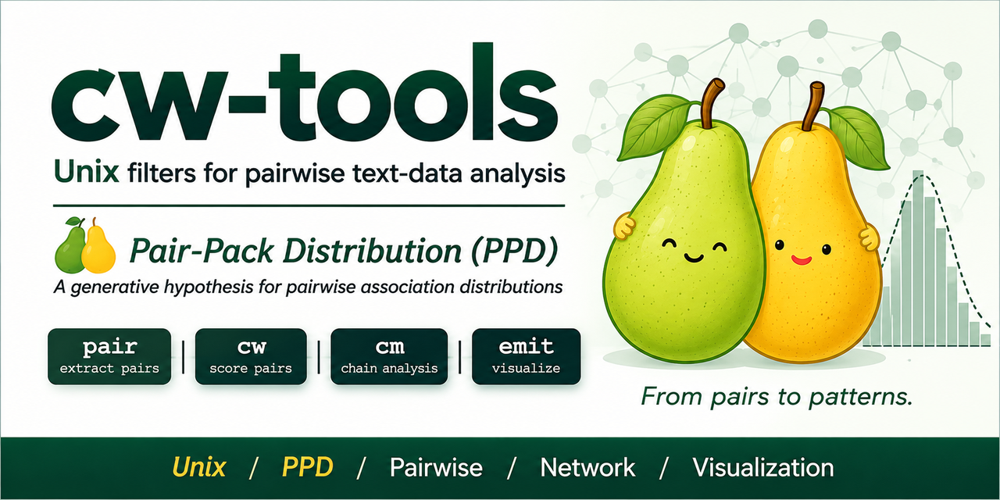

# cw-tools: Transparent Unix Filters for Exploratory Text Analysis

Last updated: 2026/08/22.

<p align="center">
  
</p>

Hilofumi Yamamoto, Ph.D.  
Institute of Science Tokyo

## Overview

`cw-tools` is a collection of small command-line programs for exploratory
text-data analysis. Each analytical stage is exposed as a readable Unix
pipeline instead of being hidden inside one application.

```text
original text
    |
    v
tokenization             minimum requirement: divide the text into tokens
    |
    v
optional annotation      lemma, POS, reading, semantic code, ...
    |
    v
   pair                   observe token relations inside each unit
    |
    v
    cw                    choose computational identity, calculate CW and Z
    |
    v
grep / awk / sort        explicit researcher-defined selection and pruning
    |
    v
   emit                   JSON, DOT, JavaScript, tables, ...
    |
    +----> D3 / Graphviz ----> interactive or static visualization
```

The minimum input requirement is deliberately small: **the text must be
tokenized**. Lemmas, part-of-speech tags, readings, semantic codes, and other
annotations are optional. A corpus can therefore begin as a simple token
sequence and acquire additional fields later.

The project is designed as **digital humanities that works alongside the
researcher** (_yorisou DH_):

> The computer should not replace the researcher's decisions. It should make
> those decisions executable, inspectable, citable, and reproducible.

The Unix pipeline is part of that design. Every intermediate stage can be
inspected directly with `head`, `grep`, `awk`, `sort`, or `lv`.

## Current development snapshot

| Program | Status | Responsibility |
| ------- | ------ | -------------- |
| `pair` | implemented | generate token pairs and preserve per-unit token frequency |
| `cw` | implemented | project patterns, calculate global/local statistics, CW, and Z |
| `emit` | implemented | serialize graphs, JavaScript data, and publication tables |
| `cm` | experimental | connect adjacent two-token relations into chains |

Record the version of every program used in an analysis. Method numbers and
command-line options should also be written explicitly even when a default
exists.

## Input data

Each input line begins with a unit identifier followed by one or more tokens:

```text
unit_id token1 token2 ... tokenN
```

The simplest input is just tokenized text:

```text
u1 春 花 咲く
u2 梅 香 匂ふ
```

A token may contain one to five slash-separated fields:

```text
f1
f1/f2
f1/f2/f3
f1/f2/f3/f4
f1/f2/f3/f4/f5
```

The field meanings are user-defined. A Japanese corpus might gradually grow
from surface forms to richer annotation:

```text
surface
surface/lemma
surface/lemma/POS
surface/lemma/POS/reading
surface/lemma/POS/reading/semantic-code
```

For the Hachidaishu BG-code data used in the examples below, the five fields
are:

```text
surface/lemma/POS/reading/BG-code
```

For example:

```text
梅/梅/02/うめ/BG-01-5520-20-0401
香/香/02/か/BG-01-5030-01-0100
```

The programs know field positions, not linguistic categories. Another project
may use the same positions for entirely different information.

This distinction is fundamental:

```text
complete token
    the full observed record retained through the pipeline

pattern
    the computational identity selected by cw -p and optionally --substr

label
    the human-facing representation selected by emit configuration
```

Computational identity and visible labeling are therefore independent.

## Quick start

Compile:

```sh
make
```

A basic whole-corpus calculation is:

```sh
./pair < input.txt | ./cw -M 1 > result.tsv
```

Because each stage is a normal text stream, it can be inspected independently:

```sh
./pair < input.txt | head
./pair < input.txt | ./cw -M 16 | head
```

## `pair`: observe relations before statistical weighting

`pair` reads each unit as a token sequence and writes pair records:

```text
unit_id token1 token2 fq1 fq2
```

The complete token is preserved. Thus a five-field token such as

```text
梅/梅/02/うめ/BG-01-5520-20-0401
```

passes through `pair` unchanged.

The default mode emits every unordered pair of distinct token types once per
unit:

```sh
./pair input.txt
```

Adjacent and windowed relations are also available:

```sh
./pair --adjacent input.txt
./pair --window 3 input.txt
./pair --adjacent --ordered input.txt
```

Adjacency is always a **two-token relation**. For a sequence

```text
A B C D
```

the directly observed adjacent relations are:

```text
A-B
B-C
C-D
```

Longer chains are constructed later from these two-token relations; they are
not themselves treated as directly observed adjacency units.

`pair` is useful independently of CW. Its line-oriented output can be inspected
before any statistical identity or weighting is imposed:

```sh
./pair input.txt | grep '梅'
./pair --adjacent --ordered input.txt | sort | uniq -c
```

See [`docs/man-pair.md`](docs/man-pair.md) for the complete specification.

## `cw`: computational identity and weighting

`cw` receives the pair stream and performs the statistical stage. It retains
complete representative tokens while projecting selected fields onto a
computational pattern.

### Pattern fields: `-p`

The default pattern fields remain `2,3,4`.

Select fields explicitly for reproducibility:

```sh
./cw -p 1
./cw -p 2,3
./cw -p 5
```

With five-field BG data,

```sh
./cw -p 5
```

uses only the BG code as the computational identity while the complete
five-field token remains available for output and display.

For example, the graph may display the human-readable label `香` even though
the internal identity is a BG code.

### Prefix projection: `--substr`

`--substr N` truncates the **projected pattern** to its first `N` bytes before
hash registration and statistical calculation.

For example:

```sh
./cw -p 5 --substr 16
./cw -p 5 --substr 18
```

With an ASCII BG code such as:

```text
BG-01-5520-20-0401
```

this makes it possible to reproduce different semantic-code levels while
retaining the complete original token for display.

This corresponds naturally to the historical CW Modelling System's level
selection:

```text
historical Level 16  ->  cw -p 5 --substr 16
historical Level 18  ->  cw -p 5 --substr 18
```

`--substr` currently counts bytes. This is intentional and safe for ASCII
classification codes such as BG codes. If it is applied to UTF-8 Japanese
text, byte length is not the same as character length.

### Exact key: `-k` / `--exact-key`

`-k` searches the projected computational pattern.

With:

```sh
./cw -p 5 --substr 16
```

a human-readable key such as `梅` is not the computational identity. An exact
key therefore uses the projected BG-code pattern, for example:

```sh
-k 'BG-01-5520-20-04'
```

This behavior makes the analytical identity explicit: the same pattern used
for hashing, DF/IDF, pair identity, and CW selection is also the pattern used
by `-k`.

### Free key: `-f` / `--free-key`

`-f` searches the **complete original token** rather than the projected
computational pattern. Matching complete tokens are resolved to the current
projected pattern, and the corresponding units are selected.

For example:

```sh
./cw -p 5 --substr 16 -f '梅'
```

lets the researcher select a readable form such as `梅` while computation
continues to use the Level-16 BG-code identity.

Thus the two key modes have different roles:

```text
-k / --exact-key   search the projected computational pattern
-f / --free-key    search complete tokens, then resolve to projected patterns
```

The two modes are mutually exclusive.

### External IDF: `--idf-out` and `--idf-in`

An IDF file is tied to the exact pattern definition used to generate it.
Therefore `-p` and `--substr` must match between `--idf-out` and
`--idf-in`.

Full BG-code IDF:

```sh
cat tests/data/hachidaishu-bg.txt \
  | ./pair \
  | ./cw -p 5 --idf-out \
  > tests/data/hachidaishu-bg.idf
```

Level-16 BG-code IDF:

```sh
cat tests/data/hachidaishu-bg-split.txt \
  | ./pair \
  | ./cw -p 5 --substr 16 --idf-out \
  > tests/data/hachidaishu-bg-split-16.idf
```

A Level-16 calculation must use a Level-16 IDF generated with the same pattern
projection. If the pattern definition does not match, `cw` reports a
missing-IDF error instead of silently mixing incompatible statistics.

### CW methods

`cw` implements four historical and explanatory methods:

| Method | Main purpose |
| -----: | ------------ |
| `1` | compact explanation of the basic CW principle |
| `7` | historical waka-graph weighting; current default |
| `12` | experimental weighting of locally rare patterns |
| `16` | global pair rarity × global token weight × local repetition |

Specify the method explicitly:

```sh
./cw -M 1
./cw -M 7 -k REGEX
./cw -M 12 -k REGEX
./cw -M 16 -f REGEX
```

Method 16 is:

$$
CW_{16}(t_1,t_2;S,C) =
\left( 1+\ln \mathrm{ctf}_{S}(t_1,t_2) \right)
\sqrt{ \mathrm{idf}_{C}(t_1)\hspace{.2em}\mathrm{idf}_{C}(t_2) }
\left( 1+ \ln \left( \frac{N}{\mathrm{cdf}_{C}(t_1,t_2)} \right) \right)
$$

The methods are not interchangeable rescalings. Raw CW values and thresholds
should be interpreted separately for each method. Z values are often more
convenient when comparing distributions produced by different methods.

### Output columns

`cw` writes one tab-separated row for each retained projected pair:

```text
token1 token2 ctf cdf df1 idf1 fq1 df2 idf2 fq2 cw z unit_id...
```

| Column | Name | Meaning |
| -----: | ---- | ------- |
| 1 | `token1` | representative complete token for pattern 1 |
| 2 | `token2` | representative complete token for pattern 2 |
| 3 | `ctf` | retained local pair frequency |
| 4 | `cdf` | selected-unit frequency of the pair |
| 5 | `df1` | global unit frequency of pattern 1 |
| 6 | `idf1` | global IDF of pattern 1 |
| 7 | `fq1` | local occurrence frequency of pattern 1 |
| 8 | `df2` | global unit frequency of pattern 2 |
| 9 | `idf2` | global IDF of pattern 2 |
| 10 | `fq2` | local occurrence frequency of pattern 2 |
| 11 | `cw` | CW under the selected method |
| 12 | `z` | Z within the selected CW distribution |
| 13... | `unit_id...` | selected units containing the pair |

See [`docs/man-cw.md`](docs/man-cw.md) for formulas and the complete option
reference.

## Hachidaishu BG-code workflow

The Hachidaishu example illustrates an important design principle: corpus
segmentation is decided **before `pair`**.

Two generated views can be prepared from the same authoritative source data:

```text
hachidaishu-bg.txt
    non-split view

hachidaishu-bg-split.txt
    split view
```

Both are deterministic derived files. The source is unique; the views differ
only in tokenization/segmentation policy.

Thus the historical CW Modelling System settings can be expressed as separate,
inspectable pipeline decisions:

```text
Unit Size   -> choose non-split or split input before pair
Level       -> cw -p 5 --substr 16 / 18
Method      -> cw -M 7 / 12 / 16
```

This separation keeps corpus-specific segmentation logic out of `pair` and
`cw`.

### Example: Kokinshu, Level 16, Method 16, key `梅`

First generate the Hachidaishu-wide Level-16 IDF from the split view:

```sh
cat tests/data/hachidaishu-bg-split.txt |
  ./pair |
  ./cw -p 5 --substr 16 --idf-out \
  > tests/data/hachidaishu-bg-split-16.idf
```

Then select Kokinshu (`grep '^1'`), use Level 16 and Method 16, and select the
readable key `梅` with `-f`:

```sh
grep '^1' tests/data/hachidaishu-bg-split.txt |
  ./pair |
  ./cw -p 5 --substr 16 \
       --idf-in tests/data/hachidaishu-bg-split-16.idf \
       -M 16 -f '梅' |
  ./emit -T js -c config/emit-config.json \
  > examples/kokin/emit-data.js
```

The roles of the stages are explicit:

```text
grep '^1'                 observation corpus: Kokinshu
pair                       observed token relations
-p 5                       identity: BG code
--substr 16                semantic level
--idf-in ...-16.idf        Hachidaishu-wide Level-16 IDF
-M 16                      CW method
-f '梅'                    readable free-key selection
emit -T js                 browser visualization data
```

The final visualization is therefore not a black-box result. The researcher
can inspect the input, pair generation, pattern projection, statistics, and
serialization separately.

## Unix filters: retain the researcher's decisions

Before `emit`, the analysis remains a line-oriented TSV stream. Conditions
that can be decided from one row should normally be written with `grep`, `awk`,
`sort`, `uniq`, `head`, or a short shell script.

Examples:

```sh
# CW at least 10
awk -F '\t' '$11 >= 10' result.tsv

# Z at least 2
awk -F '\t' '$12 >= 2' result.tsv

# CTF at least 2, CW at least 10, and Z at least 2
awk -F '\t' '$3 >= 2 && $11 >= 10 && $12 >= 2' result.tsv
```

The analytical decision is neither hidden in a GUI nor buried inside a large
custom program.

## `emit`: graph and table formatting

`emit` is a formatter. It does not recalculate IDF, CW, Z, CTF, CDF, or token
frequency. It translates already measured rows into reusable formats.

Common formats include:

```text
json
dot
js
md / markdown
tex / latex
html
```

Examples:

```sh
./emit -T dot -c config/emit-config.json result.tsv > result.dot
./emit -T js  -c config/emit-config.json result.tsv > emit-data.js
./emit -T tex -c config/emit-table.config result.tsv > result.tex
```

Pattern identity has already been decided by `cw`. Visible labels are selected
independently by `emit`. Consequently, calculations can use BG-code identity
while the graph displays a readable representative form such as `梅`, `花`, or
`香`.

### Interactive D3 output

The reusable browser renderer separates graph data, source text, appearance,
configuration, and interaction:

```text
emit-data.js             graph-specific data generated by emit
emit-texts.json          source texts indexed by unit_id
emit-d3.config.json      browser-side source-display configuration
emit-d3.js               reusable renderer
emit-d3.css              appearance rules
emit-slider.js           Z-threshold visibility control
```

The interactive viewer supports:

- Z-threshold filtering with the slider;
- edge click -> source texts for the edge's `unit_ids`;
- node click -> source texts collected from the node's currently visible edges;
- multiple source-text candidates when a relation occurs in multiple units.

The graph and source text remain separate. `emit` writes graph data and
`unit_ids`; the browser uses those identifiers to look up corresponding source
texts in `emit-texts.json`. Thus `emit` itself remains a formatter.

Browser-side source display can be configured in `emit-d3.config.json`, for
example:

```json
{
  "source": {
    "path": "emit-texts.json",
    "title": "Source texts",
    "font_size": "2.4rem"
  }
}
```

The slider changes visibility only. It does not recalculate CW, Z, ranks, the
distribution, or graph geometry.

## Self-contained Kokinshu browser example

`examples/kokin/` is a self-contained browser example. The directory contains
the HTML page, graph data, source texts, browser configuration, and the assets
needed for the interactive viewer.

Run a local server from the repository root:

```sh
python -m http.server
```

Then open:

```text
http://localhost:8000/examples/kokin/
```

The same directory layout can be served directly as static files, including
from GitHub Pages.

The reusable development versions remain under `templates/` and `assets/`;
the example directory contains the copies needed to run by itself.

## Examples and reproducible shell scripts

The repository deliberately keeps several kinds of examples:

```text
examples/kokin/          self-contained interactive browser example
examples/bochan/         Japanese text-processing example
examples/tom-sawyer/     English text-processing example
examples/shellscript/    executable command-line workflow examples
templates/               reusable D3 viewer template and generated-data slots
tests/tools/             corpus conversion utilities
tests/data/              source and derived test/example data
```

Shell scripts are useful when an analysis needs many options. They are also a
compact record of the exact procedure used to generate a figure or browser
dataset. A script may copy itself beside the generated result so that the
result keeps a snapshot of its own generation procedure.

For example:

```sh
cp "$0" ume.command
```

can preserve the exact script that generated `ume.svg`.

## `cm`: chains from adjacency

`cm` connects directed adjacent relations through shared endpoints. Adjacency
itself remains a two-token observation.

For:

```text
A B C D
```

`pair --adjacent --ordered` observes:

```text
A B
B C
C D
```

`cm` can then connect relations through shared endpoints:

```text
A-B + B-C + C-D  ->  A-B-C-D
```

The longer chain is derived from adjacent pairs; it is not treated as a
three-word or four-word adjacency observation. The interface remains
experimental.

## Distribution analysis with `rbin`

[`rbin`](https://zenodo.org/records/21229729) is an independent command-line
tool for frequency distributions, descriptive statistics, and distribution
diagnostics.

CW values are column 11 and Z values are column 12:

```sh
awk -F '\t' '{print $11}' result.tsv | rbin -c
awk -F '\t' '{print $12}' result.tsv | rbin -c
```

## Reproducible research record

A reproducible analysis should preserve at least:

1. the input dataset and unit definition;
2. the tokenization/segmentation policy;
3. the token field specification;
4. the versions of `pair`, `cw`, `cm`, and `emit` used;
5. the `pair` mode and ordering;
6. the `cw -p`, `--substr`, `-k` or `-f`, `-M`, `--idf-in`, and `--idf-out` options;
7. the unfiltered `cw` TSV output;
8. every `grep`, `awk`, `sort`, or shell-script condition;
9. the `emit` configuration;
10. the browser-side D3 configuration when applicable;
11. the final visualization or table;
12. preferably, the command script that generated the result.

The command line itself is a compact research record. For example:

```sh
grep '^1' tests/data/hachidaishu-bg-split.txt |
  ./pair |
  ./cw -p 5 --substr 16 \
       --idf-in tests/data/hachidaishu-bg-split-16.idf \
       -M 16 -f '梅' |
  ./emit -T js -c config/emit-config.json \
  > examples/kokin/emit-data.js
```

This records the corpus subset, token relation generator, semantic level,
statistical method, readable key, IDF reference, and output format in one
inspectable pipeline.

## Build and install

Compile:

```sh
make
```

Install under the default prefix:

```sh
make install
```

Install under a custom prefix:

```sh
make PREFIX=$HOME/.local install
```

Clean generated objects and binaries:

```sh
make clean
```

## Tests and sample data

Test data, conversion scripts, and examples are provided under `tests`.

Before relying on a result, inspect intermediate rows as well as the final
visualization:

```sh
./pair < input.txt | head
./pair < input.txt | ./cw -M 16 | head
```

A complete example using Natsume Soseki's _Botchan_ and MeCab/IPADIC is
provided here:

- [Natsume Soseki: _Botchan_ Example and Shell Script](examples/bochan/cw-bochan.md)

The general workflow does not depend on MeCab, KyTea, or any specific Japanese
analyzer. Any tokenizer can provide the initial token sequence; additional
fields are optional.

## Documentation

- [`docs/man-pair.md`](docs/man-pair.md) — pair generation, adjacency,
  windowing, direction, and per-unit token frequencies;
- [`docs/man-cw.md`](docs/man-cw.md) — pattern projection, reference sets,
  formulas, methods, output columns, and Z values;
- [`docs/man-emit.md`](docs/man-emit.md) — graph and table output;
- [`docs/emit-d3.md`](docs/emit-d3.md) — D3 data, layout, and Z-threshold
  interaction;
- [`docs/emit-svg.md`](docs/emit-svg.md) — semantic Graphviz SVG styling;
- [`docs/emit-url.md`](docs/emit-url.md) — edge URLs generated from unit IDs.

## Related resources

- [Hachidaishu Part-of-Speech Dataset](https://doi.org/10.5281/zenodo.13940187)  
  [](https://doi.org/10.5281/zenodo.13940187)
- [rbin: A small command-line utility for rank-based binning](https://zenodo.org/records/21229729)  
  [](https://doi.org/10.5281/zenodo.21229729)

## Citation

For a reproducible citation, record the released version or commit identifier,
the versions of the individual programs, the input/segmentation view, the
pattern fields and substring level, the IDF reference, the selected key mode,
and the selected CW method.

## License

This software is released under the MIT License. See [`LICENSE`](LICENSE) for
details.
