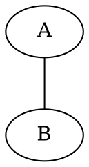
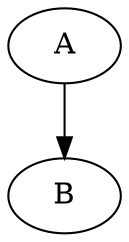

# emit

## NAME

`emit` — filter precomputed co-occurrence edges and emit reusable JSON or Graphviz DOT

## SYNOPSIS

```sh
emit [OPTION]... [FILE]
```

## DESCRIPTION

`emit` reads the enriched pair table produced by [`cw`](./man-cw.md), applies display-oriented CW and Z thresholds, and writes either:

- a reusable JSON graph dataset; or
- a Graphviz DOT description for visualization.

This manual describes `emit` version 0.2.0.

`emit` does not calculate or recalculate IDF, CW, or Z. Those values belong to the measurement stage implemented by `cw`. `emit` only decides which already calculated edges and incident nodes are included in an output representation.

The normal behavior of `emit` is defined by `emit-config.json`. Command-line options are intended only for temporary deviations from that configuration.

With no file operand, `emit` reads from standard input. At most one input file may be specified.

## PLACE IN THE CW-TOOLS PIPELINE

The current division of responsibilities is:

```text
pair
    generate token pairs within units

cw
    calculate global IDF
    select units by key
    calculate ctf and cdf
    calculate CW
    calculate Z within the selected CW distribution
    retain unit identifiers

rbin
    calculate descriptive statistics
    inspect CW and Z distributions
    produce histograms and distributional reports

emit
    apply display thresholds
    retain incident nodes
    emit JSON or Graphviz DOT
```

In a typical pipeline:

```sh
pair < data.txt \
  | cw -k '^桜$' \
  | emit > sakura.dot
```

The same calculated table can be serialized as JSON without rerunning the measurement stage:

```sh
pair < data.txt \
  | cw -k '^桜$' \
  | emit -T json > sakura.json
```

## INPUT

The expected input is the tab-separated output of `cw` version 0.4.0 or later:

```text
token1 token2 ctf cdf df1 idf1 df2 idf2 cw z unit_id...
```

The first ten fields are fixed. One trailing `unit_id` field is required for every occurrence counted by `ctf`.

| Field        | Meaning                                                 |
| ------------ | ------------------------------------------------------- |
| `token1`     | complete first token                                    |
| `token2`     | complete second token                                   |
| `ctf`        | total number of pair occurrences in the selected units  |
| `cdf`        | number of selected units containing the pair            |
| `df1`        | global document frequency of `token1`                   |
| `idf1`       | global IDF of `token1`                                  |
| `df2`        | global document frequency of `token2`                   |
| `idf2`       | global IDF of `token2`                                  |
| `cw`         | precomputed co-occurrence weight                        |
| `z`          | precomputed Z value within the selected CW distribution |
| `unit_id...` | one unit identifier for every pair occurrence           |

For example:

```text
ちり/散る/ラ四-用/ちり	桜/桜/名/さくら	2	2	17	4.17950237056	8	4.93357424796	7.2874543462720025	2.582390082806497	10064	10077
```

### Tab separation

Input fields must be separated by literal tab characters. Unlike `pair`, `emit` does not split records on general whitespace.

Each non-comment input line must contain at least ten tab-separated fields.

### Comments and blank lines

Empty lines are ignored. A line whose first character is `#` is also ignored.

### Validation

`emit` checks the following conditions:

- `ctf`, `cdf`, `df1`, and `df2` must be valid nonnegative integers;
- `ctf` must be greater than zero;
- `cdf` must not exceed `ctf`;
- `idf1`, `idf2`, `cw`, and `z` must be finite numbers;
- `token1` and `token2` must not be empty;
- every `unit_id` must be nonempty;
- the number of trailing `unit_id` fields must equal `ctf`;
- repeated occurrences of the same token must carry consistent `df` and `idf` values.

`emit` currently trusts the supplied `cdf` value after checking only that `cdf <= ctf`; it does not independently recount distinct unit identifiers.

### Tokens

A token normally contains one to four slash-separated fields:

```text
surface
surface/lemma
surface/lemma/field3
surface/lemma/field3/field4
```

The complete token string is used as the node identifier. Consequently, tokens sharing the same surface form but differing in lemma, grammatical field, or gloss remain distinct nodes.

## CONFIGURATION

By default, `emit` reads:

```text
emit-config.json
```

from the current working directory.

A configuration file is required by version 0.2.0. If the default file does not exist or cannot be parsed, `emit` exits with failure. Use `-c FILE` to select a different configuration file.

The recommended default configuration is:

```json
{
  "format": "dot",
  "filters": {
    "min_cw": null,
    "min_z": null
  },
  "dot": {
    "graph_name": "G",
    "directed": false,
    "charset": "UTF-8",
    "overlap": false,
    "outputorder": "edgesfirst"
  },
  "node": {
    "shape": "plaintext",
    "label_field": 1
  },
  "edge": {
    "label": "ctf",
    "tooltip": ["ctf", "cdf", "cw", "z", "unit_ids"],
    "penwidth": 1.0
  }
}
```

The file must be valid JSON. Comments and trailing commas are not accepted.

Unknown keys are ignored. This allows later versions to add configuration entries without making earlier parsers reject the entire file, but a misspelled recognized key may therefore silently leave its previous value unchanged.

### Precedence

Effective settings are determined in this order:

```text
internal initial values
        ↓
emit-config.json, or the file named by -c
        ↓
command-line options explicitly supplied
```

The command line does not replace the entire configuration. It overrides only the specified value.

For example:

```sh
emit -Z 2
```

uses every value from the configuration file except `filters.min_z`, which is temporarily replaced by `2`.

### `format`

```json
"format": "dot"
```

Accepted values are:

| Value    | Output              |
| -------- | ------------------- |
| `"dot"`  | Graphviz DOT        |
| `"json"` | cw-tools graph JSON |

The corresponding temporary command-line override is:

```sh
emit -T json
emit -T dot
```

### `filters`

```json
"filters": {
  "min_cw": null,
  "min_z": 1
}
```

Each threshold may be either a finite JSON number or `null`.

| Key      | Meaning                                                        |
| -------- | -------------------------------------------------------------- |
| `min_cw` | retain edges whose `cw` is greater than or equal to this value |
| `min_z`  | retain edges whose `z` is greater than or equal to this value  |
| `null`   | do not apply that threshold                                    |

When both thresholds are numbers, an edge must satisfy both conditions:

$$
cw \geq \operatorname{min\_cw}
\quad\text{and}\quad
z \geq \operatorname{min\_z}
$$

Filtering is inclusive. An edge exactly equal to the threshold is retained.

Only nodes incident to retained edges are emitted. If no edge survives, both output formats contain an empty graph.

### `dot`

The `dot` object controls the Graphviz graph declaration and graph-level attributes.

```json
"dot": {
  "graph_name": "G",
  "directed": false,
  "charset": "UTF-8",
  "overlap": false,
  "outputorder": "edgesfirst"
}
```

| Key           | Type    | Current effect                                    |
| ------------- | ------- | ------------------------------------------------- |
| `graph_name`  | string  | quoted graph name                                 |
| `directed`    | boolean | selects `graph`/`--` or `digraph`/`->`            |
| `charset`     | string  | writes the Graphviz `charset` graph attribute     |
| `overlap`     | boolean | writes the Graphviz `overlap` graph attribute     |
| `outputorder` | string  | writes the Graphviz `outputorder` graph attribute |

Setting `directed` changes only the DOT syntax. It does not reinterpret or reorder pairs supplied by `cw`.

### `node`

```json
"node": {
  "shape": "plaintext",
  "label_field": 1
}
```

| Key           | Type        | Meaning                                                    |
| ------------- | ----------- | ---------------------------------------------------------- |
| `shape`       | string      | Graphviz node `shape` attribute                            |
| `label_field` | integer 1–4 | slash-separated token field used as the visible node label |

The complete token remains the node ID. Only the visible label changes.

For example:

```text
桜/桜/名/さくら
```

with:

```json
"label_field": 1
```

is emitted as:

```dot
"桜/桜/名/さくら" [label="桜", ...];
```

If the requested field does not exist or is empty, `emit` falls back to field 1.

### `edge`

```json
"edge": {
  "label": "ctf",
  "tooltip": ["ctf", "cdf", "cw", "z", "unit_ids"],
  "penwidth": 1.0
}
```

#### `edge.label`

Accepted values are:

| Value    | Visible edge label                              |
| -------- | ----------------------------------------------- |
| `"none"` | no `label` attribute                            |
| `"ctf"`  | pair occurrence count                           |
| `"cdf"`  | distinct-unit count                             |
| `"cw"`   | CW value, formatted with six significant digits |
| `"z"`    | Z value, formatted with six significant digits  |

The full-precision CW and Z values remain separate DOT attributes even when the visible label is shortened.

#### `edge.tooltip`

`tooltip` is an array containing any of:

```text
ctf
cdf
cw
z
unit_ids
```

The selected fields are joined in one Graphviz tooltip, separated by semicolons.

An empty array disables the edge tooltip:

```json
"tooltip": []
```

#### `edge.penwidth`

`penwidth` must be greater than zero. Version 0.2.0 applies one fixed width to every edge:

```dot
edge [penwidth=1];
```

Variable line widths based on CW or Z are not yet implemented.

## OPTIONS

### `-c FILE`, `--config FILE`

Read `FILE` instead of the default `emit-config.json`.

```sh
emit -c configs/publication.json
```

The path actually used is recorded in JSON output under `emit.config`.

### `-T FORMAT`, `--format FORMAT`

Temporarily override the configured output format.

`FORMAT` must be `json` or `dot`.

```sh
emit -T json
```

### `-W VALUE`, `--min-cw VALUE`

Temporarily set the minimum retained CW value.

```sh
emit -W 5
```

`VALUE` must be a finite number. Negative values are accepted.

### `-Z VALUE`, `--min-z VALUE`

Temporarily set the minimum retained Z value.

```sh
emit -Z 1
```

`VALUE` must be a finite number. Negative values are accepted.

### `-h`, `--help`

Display a short usage summary and exit successfully.

### `-v`, `--version`

Display the program name and version:

```text
emit 0.2.0
```

## FILTERING IS A DISPLAY OPERATION

The thresholds in `emit` do not define the population used to calculate IDF, CW, or Z.

The processing order is:

```text
cw calculates every selected pair
        ↓
cw calculates Z from the complete selected CW distribution
        ↓
emit receives the completed table
        ↓
emit hides edges below display thresholds
```

Thus:

```sh
cw -k '^桜$' | emit -Z 2
```

means:

> calculate the complete exact-`桜` pair set and its Z values, then display only pairs whose already calculated Z value is at least 2.

It does not mean:

> discard low-CW pairs first and recalculate Z from the survivors.

This distinction preserves the statistical meaning of Z while allowing visualization settings to be changed repeatedly without recomputing the measurement.

## JSON OUTPUT

JSON output is selected in the configuration file or temporarily with:

```sh
emit -T json
```

The top-level structure is:

```json
{
  "format": "cw-tools/graph",
  "version": 1,
  "emit": {
    "config": "emit-config.json",
    "output_format": "json"
  },
  "filters": {
    "min_cw": null,
    "min_z": 2
  },
  "counts": {
    "nodes": 20,
    "edges": 20
  },
  "nodes": [],
  "edges": []
}
```

### Top-level members

| Member               | Meaning                                                    |
| -------------------- | ---------------------------------------------------------- |
| `format`             | data-format identifier, currently `cw-tools/graph`         |
| `version`            | JSON graph-format version, currently `1`                   |
| `emit.config`        | configuration path read by `emit`                          |
| `emit.output_format` | effective output format                                    |
| `filters`            | effective CW and Z thresholds after command-line overrides |
| `counts.nodes`       | number of emitted nodes                                    |
| `counts.edges`       | number of emitted edges                                    |
| `nodes`              | node records                                               |
| `edges`              | edge records                                               |

### Node records

A node record has the form:

```json
{
  "id": "桜/桜/名/さくら",
  "fields": ["桜", "桜", "名", "さくら"],
  "df": 8,
  "idf": 4.93357424796
}
```

| Member   | Meaning                                                |
| -------- | ------------------------------------------------------ |
| `id`     | complete token string and stable graph-node identifier |
| `fields` | token split at slash boundaries                        |
| `df`     | global token document frequency supplied by `cw`       |
| `idf`    | global token IDF supplied by `cw`                      |

Nodes are sorted lexically by complete token ID and deduplicated.

### Edge records

An edge record has the form:

```json
{
  "source": "ちり/散る/ラ四-用/ちり",
  "target": "桜/桜/名/さくら",
  "ctf": 2,
  "cdf": 2,
  "cw": 7.2874543462720025,
  "z": 2.582390082806497,
  "unit_ids": ["10064", "10077"]
}
```

| Member     | Meaning                           |
| ---------- | --------------------------------- |
| `source`   | complete source-token ID          |
| `target`   | complete target-token ID          |
| `ctf`      | pair occurrence count             |
| `cdf`      | distinct selected-unit count      |
| `cw`       | precomputed CW value              |
| `z`        | precomputed Z value               |
| `unit_ids` | occurrence-level unit identifiers |

Edge order follows input order after filtering. The normal lexical pair ordering produced by `cw` is therefore preserved.

Duplicate unit identifiers are retained in `unit_ids` when the same pair occurs more than once in one unit.

### Returning from an edge to source text

The `unit_ids` array makes the JSON graph traceable to its source units.

```text
edge
    ↓ unit_ids
source-text records
```

A downstream application can use each identifier to retrieve:

- the original text;
- anthology and poem metadata;
- author information;
- annotations or translations;
- a WakaGraph or web-view URL.

The JSON is therefore not merely a drawing intermediate. It is a reusable, source-linked research dataset.

### JSON escaping

Strings are emitted as valid JSON strings. Quotation marks, backslashes, control characters, and tab/newline characters are escaped.

The JSON output of version 0.2.0 has been validated with a standard JSON parser.

## GRAPHVIZ DOT OUTPUT

DOT output is selected by the default configuration shown above or by:

```sh
emit -T dot
```

A minimal output resembles:

```txt
graph "G" {
  graph [charset="UTF-8", overlap=false, outputorder="edgesfirst"];
  node [shape="plaintext"];
  edge [penwidth=1];

  "ちり/散る/ラ四-用/ちり" [
    label="ちり",
    df=17,
    idf=4.17950237056,
    tooltip="df=17; idf=4.17950237056"
  ];

  "桜/桜/名/さくら" [
    label="桜",
    df=8,
    idf=4.93357424796,
    tooltip="df=8; idf=4.93357424796"
  ];

  "ちり/散る/ラ四-用/ちり" -- "桜/桜/名/さくら" [
    label="2",
    ctf=2,
    cdf=2,
    cw=7.2874543462720025,
    z=2.582390082806497,
    unit_ids="10064,10077",
    tooltip="ctf=2; cdf=2; cw=7.2874543462720025; z=2.582390082806497; unit_ids=10064,10077"
  ];
}
```

The actual program writes each node or edge statement on one line.

### DOT node identity and label

The complete token is quoted and used as the DOT node ID:

```dot
"桜/桜/名/さくら"
```

The visible label is selected independently through `node.label_field`:

```dot
label="桜"
```

This prevents homographic tokens with different complete analyses from being accidentally merged.

### DOT node attributes

Every node receives:

| Attribute | Meaning                              |
| --------- | ------------------------------------ |
| `label`   | selected slash-separated token field |
| `df`      | global document frequency            |
| `idf`     | global inverse document frequency    |
| `tooltip` | `df` and `idf` in readable form      |

`df` and `idf` are retained as custom DOT attributes even when Graphviz does not use them for layout.

### DOT edge attributes

Every edge receives:

| Attribute  | Meaning                                           |
| ---------- | ------------------------------------------------- |
| `label`    | optional visible value selected by `edge.label`   |
| `ctf`      | pair occurrence count                             |
| `cdf`      | distinct selected-unit count                      |
| `cw`       | full-precision CW value                           |
| `z`        | full-precision Z value                            |
| `unit_ids` | comma-separated occurrence-level unit identifiers |
| `tooltip`  | configured readable summary                       |

The custom attributes preserve measurement information in the DOT source. `unit_ids` also retains the route back to original units.

Graphviz itself does not assign semantic meaning to the custom attributes `ctf`, `cdf`, `cw`, `z`, or `unit_ids`. They are present for inspection and downstream processing. The standard `label` and `tooltip` attributes affect rendered output.

### Directed output

When:

```json
"directed": false
```

`emit` writes:



When:

```json
"directed": true
```

it writes:



This is a serialization choice only. The current `pair` and `cw` pipeline normally produces unordered lexical pairs unless ordered pair generation was explicitly used upstream.

### DOT escaping

Node IDs, labels, graph names, tooltips, shapes, and other string attributes are quoted. Quotation marks and backslashes are escaped. Newlines are emitted as `\n`, carriage returns are removed, and tabs become spaces in DOT strings.

### Rendering DOT

`emit` writes DOT; it does not invoke Graphviz itself.

For example:

```sh
cw -k '^桜$' < pairs.txt \
  | emit > sakura.dot

neato -Tsvg sakura.dot > sakura.svg
```

Other formats are selected by Graphviz:

```sh
neato -Tpdf sakura.dot > sakura.pdf
neato -Tpng sakura.dot > sakura.png
```

The Graphviz layout engine is also chosen outside `emit`:

```sh
dot   -Tsvg graph.dot > graph-dot.svg
neato -Tsvg graph.dot > graph-neato.svg
sfdp  -Tsvg graph.dot > graph-sfdp.svg
```

This separation keeps device selection and layout execution out of the measurement and serialization programs.

## EXAMPLES

### Use the normal configured DOT output

```sh
grep '^1' tests/data/hachidaishu-pair.txt \
  | ./pair \
  | ./cw -k '^桜$' \
  | ./emit > kokin-sakura.dot
```

### Render the DOT output as SVG

```sh
neato -Tsvg kokin-sakura.dot > kokin-sakura.svg
```

### Temporarily emit JSON

```sh
grep '^1' tests/data/hachidaishu-pair.txt \
  | ./pair \
  | ./cw -k '^桜$' \
  | ./emit -T json > kokin-sakura.json
```

### Temporarily retain only Z values of at least 2

```sh
grep '^1' tests/data/hachidaishu-pair.txt \
  | ./pair \
  | ./cw -k '^桜$' \
  | ./emit -Z 2 > kokin-sakura-z2.dot
```

### Apply both CW and Z thresholds

```sh
./emit -W 5 -Z 2 cw-table.tsv > selected.dot
```

The retained edge must satisfy both conditions.

### Use another configuration file

```sh
./emit -c configs/publication.json cw-table.tsv > publication.dot
```

### Make JSON the normal output

Change:

```json
"format": "json"
```

in `emit-config.json`, then run:

```sh
./emit < cw-table.tsv > graph.json
```

No `-T` option is needed because JSON is now the recorded normal behavior.

### Make Z >= 1 the normal display condition

Change:

```json
"filters": {
  "min_cw": null,
  "min_z": 1
}
```

Then:

```sh
./emit < cw-table.tsv > graph.dot
```

records a concise command because the standard display policy is kept in the configuration file.

## BUILD

With the repository Makefile:

```sh
make emit
```

The corresponding target is:

```make
emit: $(EMIT_OBJ)
	$(CC) $(LDFLAGS) -o $@ $^
```

Version 0.2.0 does not require linking with `-lm`.

A direct build is:

```sh
cc -O2 -std=c11 -Wall -Wextra -Wpedantic \
  -o emit src/emit.c
```

## INSTALLATION

If `emit` is included in `PROGS`, the repository Makefile installs it with:

```sh
make install
```

The default destination is:

```text
/usr/local/bin/emit
```

A different prefix may be specified:

```sh
make install PREFIX="$HOME/.local"
```

`emit-config.json` is not currently installed automatically. It should remain with the project, be copied to the working directory, or be selected explicitly with `-c`.

## EXIT STATUS

`emit` exits with status 0 when output is completed successfully, including when no edge passes the configured filters.

It exits with failure for conditions including:

- an unavailable configuration or input file;
- invalid JSON configuration syntax;
- an invalid recognized configuration value;
- more than one input file operand;
- malformed or non-tab-separated input;
- inconsistent input counts or token statistics;
- an invalid command-line format or threshold;
- an output write error;
- memory allocation failure.

Diagnostics are written to standard error and normally include the input or configuration source and line number.

## CURRENT LIMITATIONS OF VERSION 0.2.0

The JSON output is already suitable as a reusable graph dataset. The DOT output is intentionally an initial implementation and will need further visual adjustment.

Current limitations include:

1. `emit-config.json` is required; there is no “use internal defaults when absent” mode.
2. A command-line option can set a threshold but cannot temporarily restore a configured threshold to `null`.
3. Edge `penwidth` is fixed for the complete graph; it cannot yet be mapped to CW, Z, or frequency.
4. Node font, font size, color, fill, margin, and size mappings are not configurable.
5. Edge font, color, style, weight, and label formatting precision are not configurable.
6. URL and hyperlink generation from `unit_ids` is not yet implemented.
7. Graph-level options such as layout hints, splines, ratio, rank direction, and separation are not yet represented.
8. `emit` does not invoke `dot`, `neato`, or another renderer.
9. The JSON output records the effective filters and configuration path, but does not yet embed the entire effective visualization configuration.
10. Unknown configuration keys are ignored, so spelling errors in keys are not always diagnosed.
11. `cdf` is not independently verified against the number of distinct `unit_ids`.

These are output-policy issues. They do not affect the IDF, CW, or Z values already calculated by `cw`.

## DESIGN PRINCIPLE

The central design distinction is:

```text
JSON
    reusable research data
    complete node and edge values
    unit identifiers linking back to source texts

DOT
    visualization description
    visible labels and tooltips
    Graphviz-specific layout and display attributes

SVG/PDF/PNG
    rendered viewing products produced from DOT
```

`emit` builds one filtered in-memory graph and sends it to separate JSON and DOT serializers. Calculation is not duplicated between output formats.

This architecture allows the same measured graph to be:

- archived as JSON;
- visualized through Graphviz;
- re-rendered with new display settings;
- linked back to original texts through `unit_ids`;
- reused by later web, statistical, or publication tools.

## FILES

```text
emit-config.json
```

Default configuration file read from the current working directory.

```text
src/emit.c
```

Source code for `emit`.

## SEE ALSO

- [`pair`](./man-pair.md)
- [`cw`](./man-cw.md)
- [`idf-cw-z`](../notes/idf-cw-z.md)
- `rbin`
- Graphviz `dot`, `neato`, and `sfdp`

## AUTHOR

Hilofumi Yamamoto  
Institute of Science Tokyo

## LICENSE

MIT License
